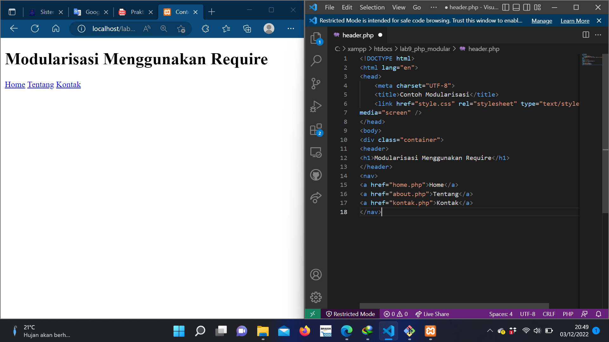
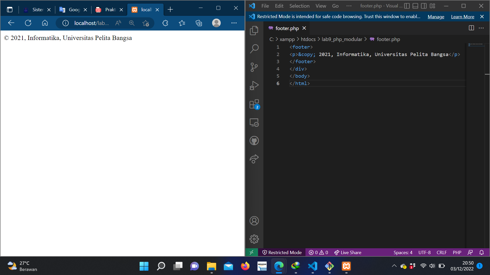
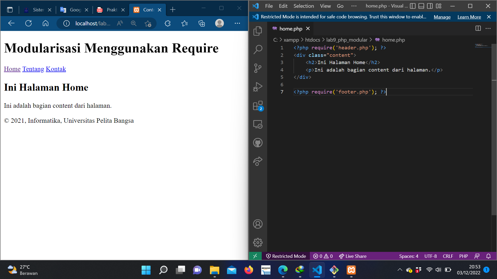
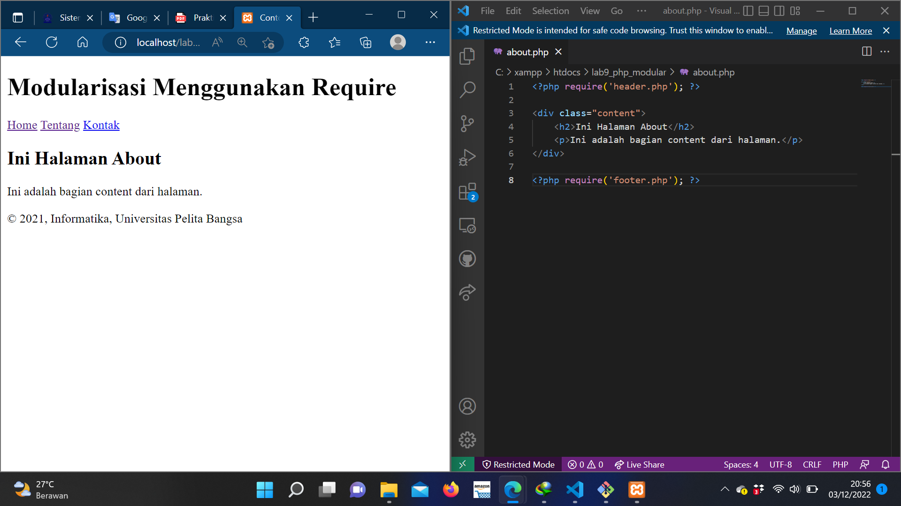
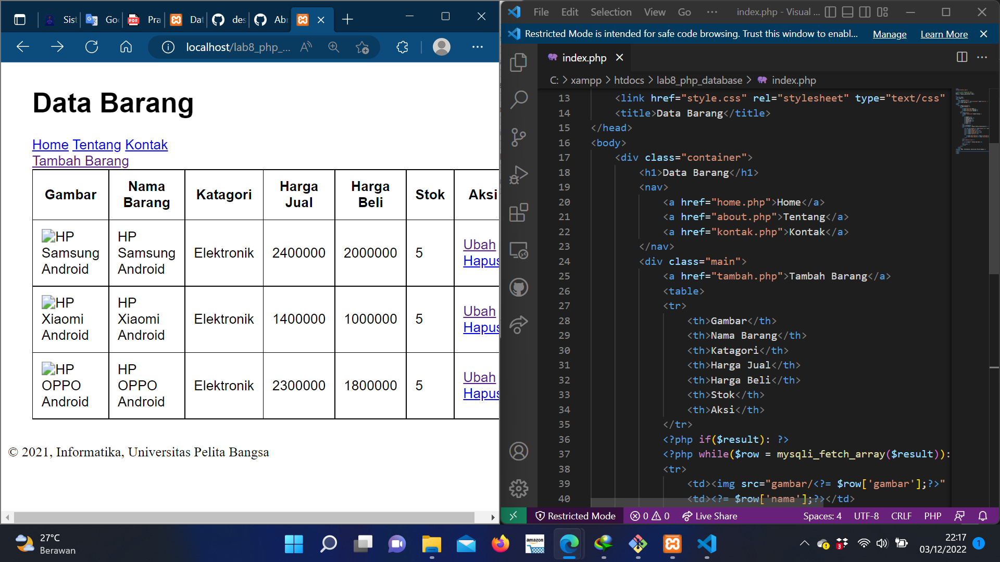

# Lab9Web

### langkah-langkah praktikum

### Buat file baru dengan nama header.php

### Buat file baru dengan nama footer.php

### Buat file baru dengan nama home.php

### Buat file baru dengan nama about.php

### Mengimplementasikan konsep modularisasi pada kode program praktikum 8 tentang database, sehingga setiap halamannya memiliki template tampilan yang sama.

